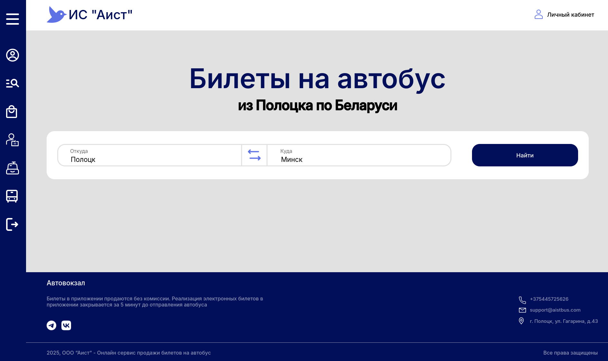

# AIST


## 🌐 Доступные языки
- 🇬🇧 [English](README.md)
- 🇷🇺 [Русский](README.ru.md)

## 🚍️ Описание
Цифровая платформа для управления расписанием автобусов, продажей билетов, мониторингом транспортных средств и обслуживанием пассажиров. Предоставляет интуитивно понятный интерфейс для сотрудников и клиентов и автоматизирует рабочие процессы.
<div align="center">
  
</div>


## 🚀 Запуск сервера
1. Склонируйте GitHub репозиторий
```sh 
git clone https://github.com/lamerous/AIST
cd AIST
```

2. Запустите сервсис Docker (установите его, если ещё этого не сделали)
```sh
sudo systemctl start docker
```

3. Запустите Docker Compose скрипт
```sh
sudo docker-compose up -d
```
P.S. API будет доступен по адресу localhost:8001
    
## ⚙️ Launch From Source
Чтобы скомпилировать десктопный клиент используйте команды:
```sh
qmake
make
```
После этого исполняемый файл будет находиться по пути ./build/bin/AIST.

## 📄 License
Проект находится под лицензией [MIT](LICENSE).
